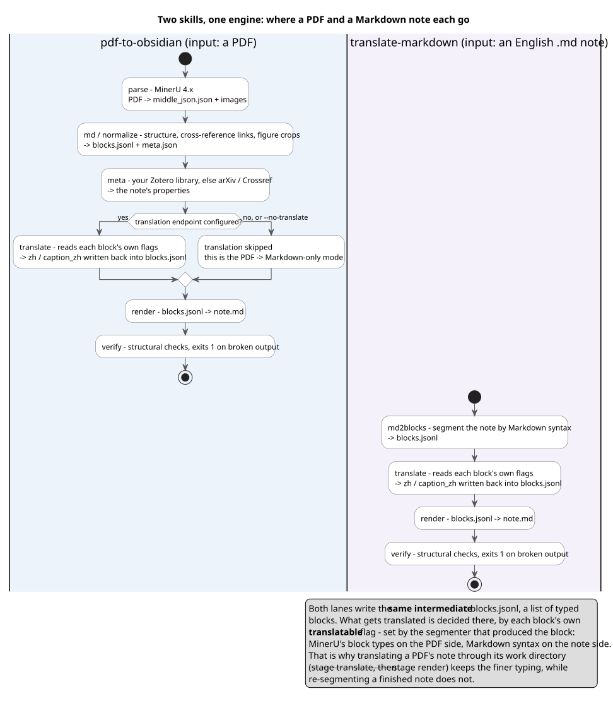

# bilingual-paper-notes

Turn an English academic PDF into **one bilingual Obsidian note**: the original
English stays readable, a Chinese translation sits underneath in collapsible
callouts, and cross-references actually click.

Built for reading and annotating papers in Obsidian, not for RAG chunking.

```markdown
The track/recover model of the previous section has two limitations:

> [!zh]+ 译文
> 上一节的 track/recover 模型有两个局限：
```

## What you get

| | |
|---|---|
| Structure | heading levels, lists, GFM tables, LaTeX display/inline equations, figure crops, footnotes, a reference list with DOI links |
| Properties | a Zotero item: `itemType`, `title`, `authors`, then the fields that item type allows, in Zotero's order — e.g. `publicationTitle`/`bookTitle`/`repository`, `date`, `volume`, `issue`, `pages`, `publisher`, `ISBN`/`ISSN`, `DOI`, `url`, `language`, `abstractNote` |
| Links | citations, theorems/lemmas/definitions, figures, tables, algorithms and sections become links — in the English **and** the Chinese half |
| Translation | paragraph-level, cached, glossary-driven, one call per batch of blocks |
| Noise removed | page numbers, headers/footers, the paper's own table of contents, stray equation labels |

Not translated (by design): headings, figure/table captions, equations, table
contents, references. Those are structural, and English keeps the outline pane
and the cross-references coherent.

## Requirements

- Python 3.10+
- [MinerU](https://github.com/opendatalab/MinerU) 4.x for PDF parsing:
  `pip install -U "mineru>=4.0,<5"`, then `mineru-kit models download --tier standard`
- PyMuPDF (`pip install pymupdf`) — optional, improves heading levels
- An OpenAI-compatible endpoint + API key for translation
- Optional: a Zotero API key, so metadata can come from your own library instead
  of a title search (see [Zotero](#zotero-optional))

Models are downloaded on the first parse (~800 MB for `--tier basic`, ~2 GB for
`standard`) and `run.py` reports which store it will use before parsing. It
looks, in order, at an explicit `--mineru-home` / `BPN_MINERU_HOME`, a
populated `<cwd>/.mineru`, a populated `~/.mineru`, and otherwise downloads into
`<cwd>/.mineru` — so each project gets its own copy unless you point
`MINERU_HOME` at one shared store (or pre-download into `~/.mineru`). If an
explicit home is empty while another store already holds models, the pipeline
warns with both paths rather than downloading 2 GB quietly. If MinerU lives in
another environment, point the pipeline at it with
`--mineru-cmd 'conda run -n mineru mineru-kit'`.

## Install

As a pi package (installs both skills):

```bash
pi install git:github.com/Eliano64/bilingual-paper-notes
```

Or clone it and call the scripts directly — nothing here imports pi:

```bash
python scripts/run.py paper.pdf
python skills/pdf-to-obsidian/SKILL.md    # what an agent reads
```

## Two skills, one code base



The two skills differ in one thing only — what they take in. Both share
`scripts/` and the same intermediate layer (`blocks.jsonl`), so rendering,
translation, caching and verification exist once; the Markdown path adds only
`md2blocks.py`, a segmenter, because there is nothing to extract.

`pdf-to-obsidian` (a PDF in) has two modes:

```bash
python scripts/run.py paper.pdf                  # PDF -> Markdown + Chinese
python scripts/run.py paper.pdf --no-translate    # PDF -> Markdown only
```

`translate-markdown` (an English `.md` in) owns the md → bilingual-md half: it
takes a note that is already Markdown — a paper's Markdown source, or a note
`pdf-to-obsidian` wrote — and adds the Chinese. Translating a note that came from
the PDF path is best done through its work directory, where the typed blocks are
still available:

```bash
python scripts/run.py paper.pdf --stage translate   # reads blocks.jsonl
python scripts/run.py paper.pdf --stage render      # re-renders the note
```

Four things people ask for, and where each lands:

| The user wants | Use |
|---|---|
| a PDF turned into an Obsidian note | `pdf-to-obsidian` |
| a PDF readable bilingually | `pdf-to-obsidian` (translation is on by default) |
| structure, metadata and links only, no translation | `pdf-to-obsidian --no-translate` |
| an existing Markdown note translated | `translate-markdown` |

The diagram is generated from `assets/workflow.puml` (`puml assets/workflow.puml`).

## Other harnesses and non-pi use

There is no pi dependency in the pipeline: standard library plus optional
PyMuPDF, and the translation endpoint comes from `--base-url` / `--api-key` /
`--model`, the `BPN_*` (or `OPENAI_*`) environment variables, or a
`.bilingual-paper-notes.json` config file. Reading pi's own config is only a last-resort
fallback for zero-config use on a pi machine; on a machine without pi that file
does not exist and you get a clear error naming the variables to set.

Both `SKILL.md` files follow the [Agent Skills](https://agentskills.io/specification)
standard, so other harnesses (Claude Code, Codex, ...) can load them.

The scripts are shared and referenced as `../../scripts/…`, so **keep the whole
repository present**: point the other harness at this repository's `skills/`
directory instead of copying a single skill directory out of it — a lone
`skills/pdf-to-obsidian/` would not find `scripts/run.py`.

## Quick start

```bash
pip install -U "mineru>=4.0,<5" pymupdf
mineru-kit models download --tier standard

git clone https://github.com/Eliano64/bilingual-paper-notes
cd bilingual-paper-notes

export BPN_BASE_URL=https://api.deepseek.com/v1
export BPN_API_KEY=sk-...
export BPN_MODEL=deepseek-flash

python scripts/run.py paper.pdf --vault ~/Obsidian/MyVault
```

Output, self-contained and safe to drop anywhere in a vault:

```
paper.md-out/
├── md/
│   ├── paper.md            the note
│   ├── paper.assets/       figure crops and equation crops
│   ├── blocks.jsonl        the intermediate layer (one record per block)
│   ├── meta.json           document metadata, warnings, provenance
│   └── translate.sqlite    translation cache
└── parse/                  raw MinerU output, kept so stages can be re-run
```

## Stages

```
parse      MinerU          PDF -> middle_json.json + images
md         normalize       middle_json -> blocks.jsonl -> note.md
           md2blocks       (Markdown input instead of parse + normalize)
meta       Zotero / arXiv / Crossref   the document's identity, as a Zotero item
translate  LLM             Chinese into blocks.jsonl
render     normalize       note.md written from blocks.jsonl
verify     —               structural checks; exits 1 on broken output
```

Each stage is idempotent and re-runnable on its own (`--stage translate`), and
the file that everything reads and writes is `blocks.jsonl`. Changing how the
note *looks* costs nothing:

```bash
python scripts/run.py paper.pdf --stage render --zh-style quote
```

## Configuration

Translation endpoint, resolved in this order:

1. `--base-url` / `--api-key` / `--model`
2. `BPN_BASE_URL` / `BPN_API_KEY` / `BPN_MODEL` (or the `OPENAI_*` equivalents)
3. `.bilingual-paper-notes.json` in the working directory, or `~/.config/bilingual-paper-notes/config.json`
4. pi's own provider config, if pi is installed

```json
{
  "base_url": "https://api.deepseek.com/v1",
  "api_key": "sk-...",
  "model": "deepseek-flash",
  "price": { "input": 0.3, "output": 1.2, "cacheRead": 0.006 }
}
```

`price` is optional and only used to print a cost estimate.

### Zotero (optional)

Step-by-step instructions, including creating the key and troubleshooting:
**[ZOTERO.md](ZOTERO.md)**.

Metadata comes out shaped like a Zotero item. If the paper is already in your
Zotero library, that library is the better source: it is authoritative, needs no
title matching, and returns exactly the fields Zotero defines. It is read
through the Zotero Web API, so **no Zotero installation is needed**, and this
pipeline only ever issues GET requests.

Create a key at <https://www.zotero.org/settings/keys/new> — read access is
enough, write access is never used — and put it in the same
`.bilingual-paper-notes.json` as above:

```json
{ "zotero": { "api_key": "..." } }
```

or export `ZOTERO_API_KEY` for the session. The library id is read from the key
itself, so nothing else is required; add `"library": "groups/12345"` beside the
key to read a group library instead of your personal one.

Without a key nothing breaks: the pipeline reads arXiv and Crossref, which fill
the same fields but have to match by title. `--no-zotero` skips the library on
purpose, and `python scripts/zotero.py --guide` reprints these instructions.

### Glossary

`scripts/glossary.txt` ships with generic academic vocabulary plus the
structural terms the render stage needs. For a real paper, copy it and add your
field's vocabulary — terminology consistency across 700 paragraphs is the whole
reason translation happens through an LLM here instead of a machine-translation
API. See `examples/glossary.example.txt`.

## Measured baseline

One 92-page, equation-heavy paper, on a laptop with a mobile GPU, standard tier:

| | |
|---|---|
| Parse | 358 s (MinerU, VLM pass) |
| Translate | 124 s, ~0.16, 731 blocks, 0 failures |
| Re-render | instant, free |
| Re-translate after a glossary edit | full run, cached blocks are skipped |

## Obsidian setup

- The note uses `![[paper.assets/…]]` and `[[paper.pdf#page=12]]`. Obsidian
  resolves both by path suffix, so the folder can live anywhere in the vault —
  as long as the PDF is inside the vault too.
- `assets/bilingual-paper-notes.css` styles the 译文 callout (muted title line, tight spacing).
  Copy it to `<vault>/.obsidian/snippets/` and enable it in Appearance.
- The note does not link or reference the source PDF, and carries no page
  numbers or page links (by decision: they would be the only thing pointing at a
  file the note does not own).

## Privacy

- The PDF is parsed **locally**.
- Metadata lookups send only the **title** (and, for arXiv, the arXiv id) to
  arXiv and Crossref. If you configure a Zotero key, that request goes to
  `api.zotero.org` and reads your own library; the key is read from a gitignored
  file and is never written by these scripts.
- Translation sends the **paper text** to whatever endpoint you configure.
  Nothing else leaves the machine, and no key is ever written by these scripts.
- `.bilingual-paper-notes.json` is in `.gitignore` for that reason.

## Scope and boundaries

Supported: academic papers, preprints, technical reports, and English Markdown
notes.

**Not supported, by decision rather than omission:**

- **Slides / lecture decks.** Landscape pages with a few short text boxes per
  page break every paper-shaped heuristic (front-matter block, references
  section, citation links) and the paragraph-level callout layout reads badly on
  fragments. Metadata lookup cannot succeed either. The skill documents this
  instead of guessing.
- **Books and long textbooks (100+ pages).** A 92-page paper already produces a
  ~0.5 MB note; a textbook would be several MB in one file, which degrades
  Obsidian's editor, search and outline pane, and makes review impossible. Split
  by chapter first — ideally along the PDF's own outline — and produce one note
  per chapter plus an index note.

## Interaction with other skills and plugins

This package ships **skills only** — no pi extension, no custom tool, no slash
command beyond the automatic `/skill:<name>` entries, and it never edits
`~/.pi/agent/settings.json` or any other global config. The only files it
creates are the ones listed above, inside the output directory it is given
(plus `.bilingual-paper-notes/<stem>/` for Markdown input).

Where neighbouring skills own the task:

| If the user wants… | Use |
|---|---|
| to create, merge, fill or visually check a PDF | the `pdf` skill |
| to author or repair Obsidian syntax (wikilinks, callouts, properties) | `obsidian-markdown` |
| vault operations, search, plugin development | `obsidian-cli` |
| to convert or translate a whole document into a note | this package |

## Known limitations

- Metadata is best-effort and never guessed: an unregistered paper gets its
  arXiv id and date but no DOI, and a field with no source stays empty rather
  than being inferred.
- Affiliations come from what the title block states: the author's own line, the
  affiliation markers that line carries (`1,2,*`) against the paper's
  marker-to-institution list, or the paper's single affiliation. An author whose
  affiliation cannot be established that way keeps none, rather than inheriting
  someone else's.
- Numeric citations (`[12]`, `[8–10]`) are linked; author-year styles
  (`(Smith et al., 2024)`) are left as text.
- Section-numbered heading levels come from the section numbering; papers whose
  headings are unnumbered rely on the PDF outline (PyMuPDF).
- Cross-reference links are built from naming patterns (`Theorem 7`,
  `定理 7`, `Table 1`, `第 3.1 节`). Unusual phrasings stay plain text.
- MinerU occasionally splits a word across a line (`Defin ition 24`); the
  translation stage usually repairs it, the English half does not.
- No equation-number references: this pipeline tags equations but does not link
  `(48)` back to the equation, because bare `(N)` in prose is usually a clause
  number, not an equation.

## License

MIT
